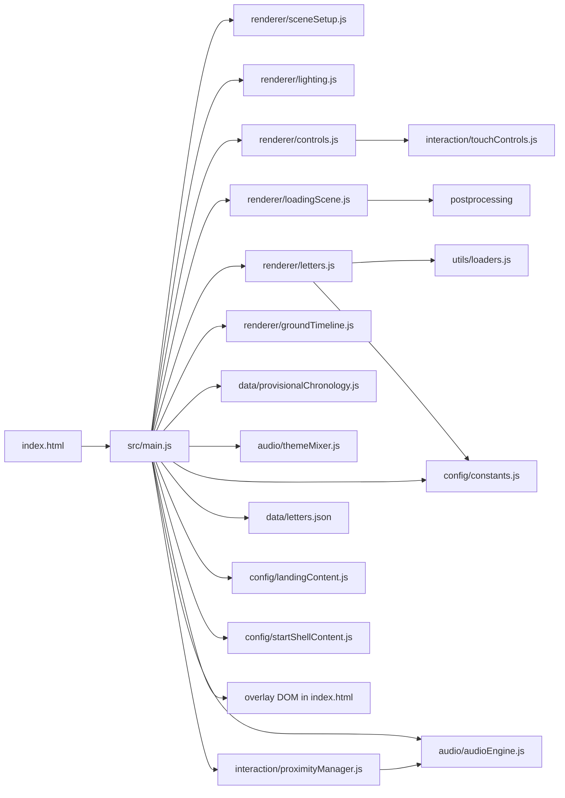

# 01. Architecture

## Runtime shape

- Entry shell: `index.html` loads `/src/styles/main.css` and boots `/src/main.js`.
- Main orchestrator: `src/main.js` wires DOM overlays, creates both Three.js renderers, starts asset loading, activates audio/controls, and owns the archive render loop.
- Two renderer model:
  - `src/renderer/loadingScene.js` owns the cinematic intro renderer/composer inside `#loading-scene-container`.
  - `src/renderer/sceneSetup.js` owns the archive renderer appended to `document.body`.
- Content source of truth: `src/data/letters.json` plus static assets under `public/assets/`.
- Deploy shell: `vite.config.js`, `public/_headers`, and `public/_redirects`.

## Design token system

`src/styles/main.css` `:root` defines CSS custom properties for consistent styling:

- **Text color**: `--text-primary` through `--text-ghost` (5 semantic opacity levels)
- **Type scale**: `--text-xs` through `--text-xl` (5 steps; display sizes use one-off `clamp()` expressions)
- **Spacing**: `--space-1` through `--space-8` (4px grid; responsive `clamp()` spacing stays inline)
- **Accent**: `--accent-rgb` (raw `102, 136, 204` for `rgba()` usage; same value as `--zone1-glow`)
- **Blur**: `--blur-sm` / `--blur-md` / `--blur-lg` (3 tiers: 5px / 12px / 18px)
- **Radius**: `--radius-sm` through `--radius-pill` (5 steps)

Existing tokens (`--shell-panel-bg`, `--shell-panel-border`, `--shell-panel-shadow`, `--shell-glow`, `--shell-kicker-color`, `--zone1-glow`) remain canonical for the glass panel system.

## Subsystem map

| Layer | Owner files | Owns | Does not own |
| --- | --- | --- | --- |
| Boot + UI shell | `index.html`, `src/main.js`, `src/styles/main.css` | overlay DOM, landing/start/pause/loading screens, preview/subtitle HUD, inspect prompt/overlay, top-level sequencing, deferred loading trigger from landing CTA | scene internals, audio internals, per-letter proximity math |
| Archive rendering | `src/renderer/sceneSetup.js`, `src/renderer/lighting.js` | archive `scene`, `camera`, `renderer`, inspect-quality pixel-ratio switching, ground/grid, resize handling, base light rig | GLB loading, audio, DOM flow |
| Controls + movement | `src/renderer/controls.js`, `src/interaction/touchControls.js` | pointer lock, touch UI, camera movement, bird's-eye mode, inspect suppression seam, key state | narration selection, preview UI, asset loading |
| Letter loading + scene content | `src/renderer/letters.js`, `src/utils/loaders.js` | GLB fetch/retry, model transforms, material replacement, string geometry, interaction metadata/focus helpers, `userData` attachment | DOM preview/subtitles, audio playback decisions |
| Ground chronology | `src/renderer/groundTimeline.js`, `src/data/provisionalChronology.js` | sequential floor spine through all letters in ID order, per-letter anchors, cached ground label textures, safe disable when chronology or loaded-letter coverage is incomplete | exact per-letter dates, DOM UI, movement math, target scoring |
| Orbit inspection | `src/renderer/orbitInspect.js` | isolated orbit viewer: own scene, camera, WebGLRenderer, OrbitControls, studio lighting, model cloning, lazy init | main scene, main camera, post-processing, DOM overlays, movement/targeting |
| Loading intro | `src/renderer/loadingScene.js` | Sednaya intro scene, postprocessing, separate renderer lifecycle, skip/completion callbacks | archive gameplay loop, letter data, pause/start UI |
| Audio | `src/audio/audioEngine.js` | background theme playback, narration lazy loading, ducking, pause/resume, unload | active-letter detection, visual highlighting, theme choice policy |
| Theme mixing | `src/audio/themeMixer.js` | only current active-letter/theme bookkeeping and logging | actual crossfade or soundtrack switching |
| Proximity | `src/interaction/proximityManager.js` | readable-side candidate/active scoring, narration trigger, highlight/unhighlight hooks, minimal targeting snapshot | DOM preview/subtitles, theme selection, movement, inspect UI |
| Data + config | `src/data/letters.json`, `src/config/constants.js`, `src/config/landingContent.js`, `src/config/startShellContent.js`, `src/config/zoneVelocity.js` | metadata schema, asset paths, positions/zones, tuning constants, landing/start screen text content, zone-adaptive walking speed | renderer or audio lifecycle logic |
| Build + deploy | `package.json`, `vite.config.js`, `public/_headers`, `public/_redirects` | local scripts, aliases, static asset copying, Pages routing/headers | runtime sequencing decisions |

## Dependency flow from `src/main.js`

## Ownership boundaries

### Rendering

- `sceneSetup.js` owns the archive renderer lifecycle.
- `sceneSetup.js` may expose renderer-quality toggles used by inspect mode, but `main.js` still decides when inspect is active.
- `loadingScene.js` is intentionally separate and should stay separate unless the intro is redesigned end-to-end.
- `letters.js` may mutate loaded model materials and transforms, but it should not own screen overlays or audio policy.
- `groundTimeline.js` owns the sequential spine meshes, anchor meshes, and label-plane textures once the scene is active.
- `groundTimeline.js` should stay scene-native and should not absorb DOM, input, or targeting ownership.
- `orbitInspect.js` owns an isolated WebGL context, scene, camera, and OrbitControls for the 3D orbit sub-mode within inspect. It must never share the main renderer or camera.
- `orbitInspect.js` is lazy-initialized by `main.js` on first use and renders independently after `composer.render()`.

### Controls

- `controls.js` is the only place that should translate keyboard/touch state into camera motion.
- `main.js` should only activate/deactivate controls, request inspect suppression, and read status (`isBirdEyeView()`, velocity, lock state).
- `touchControls.js` owns the extra mobile DOM it injects; no other module should create duplicate touch UI.

### Loading

- `loadingScene.js` owns intro progress and skip behavior.
- `main.js` owns the dual gate: archive entry is blocked until both intro completion and archive asset loading finish.
- `letters.js` owns retry logic and partial-success model loading behavior.

### Audio

- `audioEngine.js` is the only working audio backend. It manages dual themes (themeA + themeB) and narrations.
- `themeMixer.js` owns the per-frame crossfade computation: it receives camera z-position and calls `audioEngine.setThemeVolumes()`.
- `ProximityManager` decides when narration starts/stops; `main.js` decides when the overall audio system is initialized.

### Theme mixing

- Owner: `src/audio/themeMixer.js`.
- Computes linear crossfade between theme A (zones 1-2) and theme B (zones 3-4) based on camera z-position.
- `audioEngine.js` owns the Howl instances, ducking, pause/resume, and disposal for both themes.

### Proximity

- `ProximityManager` owns candidate/active-letter scoring and narration trigger timing.
- `main.js` consumes only the minimal candidate/active snapshot to update preview images, subtitles, inspect affordances, and the placeholder theme mixer.

### Metadata

- `letters.json` owns IDs, zones, positions, and asset references.
- `provisionalChronology.js` owns grouped chronology labels and group coverage only; it is intentionally not the archival source of truth for exact dates.
- `letters.js` copies those fields into `model.userData`; other modules read from that snapshot at runtime.
- Treat `letters.json` as declarative data, not as a place for transient runtime state.

## Relevant skills/MCPs for this layer

- `threejs-fundamentals`: scene/camera/renderer ownership, resize behavior, object hierarchy.
- `threejs-loaders`: GLB loading, retry behavior, loader policy, public asset assumptions.
- `threejs-interaction`: pointer lock, touch controls, active-letter flow.
- `threejs-lighting`, `threejs-materials`, `threejs-textures`: letter readability, glass treatment, texture color-space handling.
- `threejs-postprocessing`: intro-only composer/effects work in `loadingScene.js`.
- `threejs-animation`, `threejs-geometry`: letter sway/bob logic and string line geometry.
- `threejs-shaders`: parked until actual GLSL/shader files appear.
- `sequential-thinking`: use first for non-trivial repo work.
- `deepwiki`: second-opinion summary only after local reads.
- `context7`: current Vite/Howler/Pages semantics when wording docs or deploy constraints.
- `playwright` plus `playwright-cli`: browser validation only after runtime/UI changes, not for first-pass architecture reading.
