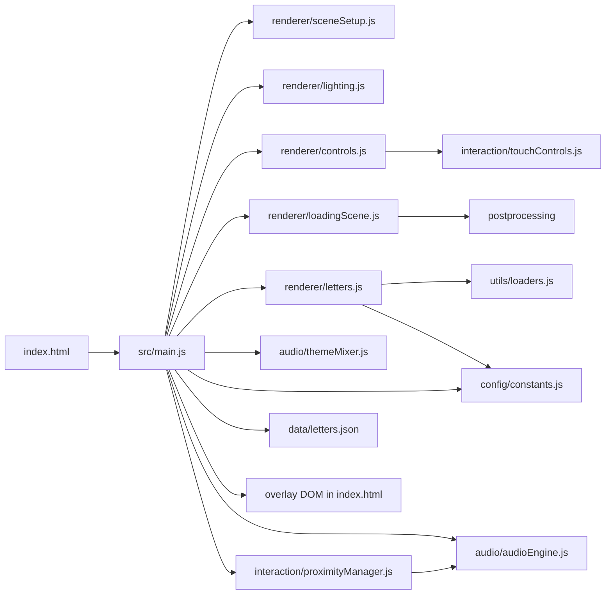

# 01. Architecture

## Runtime shape

- Entry shell: `index.html` loads `/src/styles/main.css` and boots `/src/main.js`.
- Main orchestrator: `src/main.js` wires DOM overlays, creates both Three.js renderers, starts asset loading, activates audio/controls, and owns the archive render loop.
- Two renderer model:
  - `src/renderer/loadingScene.js` owns the cinematic intro renderer/composer inside `#loading-scene-container`.
  - `src/renderer/sceneSetup.js` owns the archive renderer appended to `document.body`.
- Content source of truth: `src/data/letters.json` plus static assets under `public/assets/`.
- Deploy shell: `vite.config.js`, `public/_headers`, and `public/_redirects`.

## Subsystem map

| Layer | Owner files | Owns | Does not own |
| --- | --- | --- | --- |
| Boot + UI shell | `index.html`, `src/main.js`, `src/styles/main.css` | overlay DOM, start/pause/loading screens, preview/subtitle HUD, top-level sequencing | scene internals, audio internals, per-letter proximity math |
| Archive rendering | `src/renderer/sceneSetup.js`, `src/renderer/lighting.js` | archive `scene`, `camera`, `renderer`, ground/grid, resize handling, base light rig | GLB loading, audio, DOM flow |
| Controls + movement | `src/renderer/controls.js`, `src/interaction/touchControls.js` | pointer lock, touch UI, camera movement, bird's-eye mode, key state | narration selection, preview UI, asset loading |
| Letter loading + scene content | `src/renderer/letters.js`, `src/utils/loaders.js` | GLB fetch/retry, model transforms, material replacement, string geometry, `userData` attachment | DOM preview/subtitles, audio playback decisions |
| Loading intro | `src/renderer/loadingScene.js` | Sednaya intro scene, postprocessing, separate renderer lifecycle, skip/completion callbacks | archive gameplay loop, letter data, pause/start UI |
| Audio | `src/audio/audioEngine.js` | background theme playback, narration lazy loading, ducking, pause/resume, unload | active-letter detection, visual highlighting, theme choice policy |
| Theme mixing | `src/audio/themeMixer.js` | only current active-letter/theme bookkeeping and logging | actual crossfade or soundtrack switching |
| Proximity | `src/interaction/proximityManager.js` | nearest-letter search, threshold logic, narration trigger, highlight/unhighlight hooks | DOM preview/subtitles, theme selection, movement |
| Data + config | `src/data/letters.json`, `src/config/constants.js` | metadata schema, asset paths, positions/zones, tuning constants | renderer or audio lifecycle logic |
| Build + deploy | `package.json`, `vite.config.js`, `public/_headers`, `public/_redirects` | local scripts, aliases, static asset copying, Pages routing/headers | runtime sequencing decisions |

## Dependency flow from `src/main.js`

## Ownership boundaries

### Rendering

- `sceneSetup.js` owns the archive renderer lifecycle.
- `loadingScene.js` is intentionally separate and should stay separate unless the intro is redesigned end-to-end.
- `letters.js` may mutate loaded model materials and transforms, but it should not own screen overlays or audio policy.

### Controls

- `controls.js` is the only place that should translate keyboard/touch state into camera motion.
- `main.js` should only activate/deactivate controls and read status (`isBirdEyeView()`, velocity, lock state).
- `touchControls.js` owns the extra mobile DOM it injects; no other module should create duplicate touch UI.

### Loading

- `loadingScene.js` owns intro progress and skip behavior.
- `main.js` owns the dual gate: archive entry is blocked until both intro completion and archive asset loading finish.
- `letters.js` owns retry logic and partial-success model loading behavior.

### Audio

- `audioEngine.js` is the only working audio backend.
- `themeMixer.js` is not a real mixer yet. Do not assume `letter.theme` changes playback.
- `ProximityManager` decides when narration starts/stops; `main.js` decides when the overall audio system is initialized.

### Theme mixing

- Current owner is nominal only: `src/audio/themeMixer.js`.
- Current behavior is logging/state only; soundtrack switching still effectively belongs to `audioEngine.playBackgroundTheme(AUDIO.THEME_PATH)` in `main.js`.

### Proximity

- `ProximityManager` owns active-letter selection and narration trigger timing.
- `main.js` consumes the active ID to update preview images, subtitles, and the placeholder theme mixer.

### Metadata

- `letters.json` owns IDs, zones, positions, and asset references.
- `letters.js` copies those fields into `model.userData`; other modules read from that snapshot at runtime.
- Treat `letters.json` as declarative data, not as a place for transient runtime state.

## Relevant skills/MCPs for this layer

- `threejs-fundamentals`: scene/camera/renderer ownership, resize behavior, object hierarchy.
- `threejs-loaders`: GLB loading, retry behavior, loader policy, public asset assumptions.
- `threejs-interaction`: pointer lock, touch controls, active-letter flow.
- `threejs-lighting`, `threejs-materials`, `threejs-textures`: letter readability, glass treatment, texture color-space handling.
- `threejs-postprocessing`: intro-only composer/effects work in `loadingScene.js`.
- `threejs-animation`, `threejs-geometry`: letter sway/bob logic and string line geometry.
- `threejs-shaders`: parked until actual GLSL/shader files appear.
- `sequential-thinking`: use first for non-trivial repo work.
- `deepwiki`: second-opinion summary only after local reads.
- `context7`: current Vite/Howler/Pages semantics when wording docs or deploy constraints.
- `playwright`: browser validation only after runtime/UI changes, not for first-pass architecture reading.
